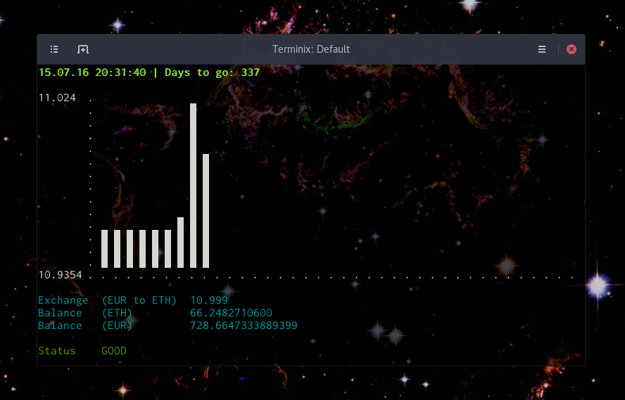

`ether-tracker` is a small nodejs based application to track Ethereum related 
information by utilising the APIs provided by kraken.com.

### Table of Contents
1. [Features](#features)
2. [Changelog](#changelog)
3. [Installation](#installation)
4. [Kraken API](#kraken-api)
5. [CLI](#cli)
6. [Future Plans](#future-plans)
7. [Security](#security)
8. [Known Problems](#known-problems)
9. [Copyright/Licensing](#copyrightlicensing)
10. [Donate](#donate)

### Features
- Timestamp of last update
- Days until a year is gone since the purchase (can be useful concerning taxes)
- Graph of the last exchange rates
- Current exchange (EUR to ETH)
- Current balance (ETH)
- Current balance (EUR)

### Changelog
Have a look at the [CHANGELOG.md](CHANGELOG.md).

### Installation
Simply via npm `npm install -g ether-tracker`.

And start the program by typing `ether-tracker` into your command line.

### Kraken API
To use this tracker you can specify a kraken API key and secret, so your current 
founds can be queried and displayed. Simply login to kraken, go 
[here](https://www.kraken.com/u/settings/api) and generate a new key. I would 
suggest to only check the box entitled with *Query Funds* as this is the only one 
you actually need. After generating you can simply copy paste the key and secret 
into your console like shown below.

### CLI
The CLI provides some options to be set by user on the startup of the tracker.  

This is how one could start the tracker:
```
ether-tracker -k KEY -s SECRET  -c EUR -d 2016-01-13 -i 120 -l false
```
Or without an API key and secret to only show the graph without your balance:
```
ether-tracker -c EUR -i 10
```

The configuration is saved in 'config/user.config.json'. Everytime you update a 
config parameter, the old one gets overridden.

All options can be found by using the help command:
```
$ ether-tracker --help

Usage: ether-tracker

  Changelog: https://github.com/nobol/ether-tracker/blob/master/CHANGELOG.md
  Readme:    https://github.com/nobol/ether-tracker/blob/master/README.md

  Options:

    -h, --help                           output usage information
    -V, --version                        output the version number
    -p, --print                          print the current configuration
    -r, --reset                          reset the current configuration
    -i, --intervall [time of intervall]  update intervall in seconds
    -d, --day [day bought]               day bought
    -k, --key [kraken key]               your kraken key
    -s, --secret [kraken secret]         your kraken secret
    -c, --currency [exchange currency]   currency to exchange, options in the README
    -w, --chartWidth [width of chart]    width of the chart in chars
    -h, --chartHeight [height of chart]  height of the chart in chars
    -l, --log [true or false]            enables or disables the log

```

Format for day: `YYYY-MM-DD`

Possible options for `exchangeKey`:  
`CAD` `EUR` `GBP` `JPY` `USD` `CAD` `EUR` `USD` `XBT` `LTC` `NMC` `XDG` `XLM` `XRP`

### Future Plans
- chart only (so you don't need a kraken account)

### Security
Be aware that your kraken API key and secret are not encrypted, but stored locally 
on your machine. That means that anyone with access to your machine can find the 
config file with your credentials, if one knows where to search for!

### Known Problems

Sometimes it seems like the kraken API is a bit overwhelmed by all our love, so the 
programm is not shutting down anymore, when an API call failed. But informs the user 
and tries it again at the next interval.

### Copyright/Licensing
ISC

### Donate
You can send me some ether of course: `0x3c623e0a6E0dAbB80c720E0CeaE653742e98b5DF`
